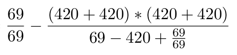

# Minimal Expression Search
Inspired by people being dumb


It's clear that this math is incorrect. [That
guy](https://github.com/SandSnip3r/RandomPostfixEquation) was curious
if he could find a real expression that equaled 2017.

And he did!  However, it took him 16 terms and 15 operators.

So I wondered: is there a shorter way?

Yes, there is!


And here's a [WolframAlpha query/proof](https://www.wolframalpha.com/input/?i=\frac{69}{69}+-+\frac{%28420%2B420%29*%28420%2B420%29}{69-420%2B\frac{69}{69}}).

Only 10 terms and 9 operators, whoa! (If you think there are 8 in the picture, then you forgot multiplication.)

## For other results

Just adapt the `goal` on line 24 and the `provide`d numbers starting at line 236 (beginning of `main`).

Compile with `clang++ -std=c++11 -O3 -DNDEBUG -o minrpn minrpn.cpp` for speed.
See the header of `minrpn.cpp` for instructions how to turn on warnings.

Using my favourite numbers, next year could be "easily" expressed like this:
```
2018 = ((((42+42)/42)+42)-((777+777)-((42+42)*42)))
```

## Terminology

Here's the output generated for the example above:
```
Now at level 1 (2 open, 2 of that on current level)
Now at level 2 (10 open, 10 of that on current level)
Now at level 3 (140 open, 46 of that on current level)
Now at level 4 (1684 open, 188 of that on current level)
Expanding -31815 at depth 4, 4811 open (146 on current level), 99 closed.
Expanding 945 at depth 4, 8538 open (96 on current level), 149 closed.
Expanding 36 at depth 4, 14350 open (21 on current level), 224 closed.
Now at level 5 (16503 open, 669 of that on current level)
One way (9 terms) = ((((42+42)/42)+42)-((777+777)-((42+42)*42)))
Expanding -64449 at depth 5, 20271 open (578 on current level), 336 closed.
Expanding -571830 at depth 5, 21897 open (410 on current level), 504 closed.
Expanding -1174782 at depth 5, 23693 open (158 on current level), 756 closed.
Now at level 6 (22604 open, 2244 of that on current level)
Expanding -34355 at depth 6, 22976 open (2024 on current level), 1134 closed.
Expanding 179046 at depth 6, 23699 open (1457 on current level), 1701 closed.
Expanding -367 at depth 6, 24318 open (606 on current level), 2552 closed.
Now at level 7 (24859 open, 7168 of that on current level)
Expanding -12630 at depth 7, 24638 open (6498 on current level), 3828 closed.
Expanding 573846 at depth 7, 23810 open (4584 on current level), 5742 closed.
Expanding 206388 at depth 7, 22080 open (1713 on current level), 8613 closed.
Now at level 8 (21535 open, 21534 of that on current level)
Done after 10328 steps.  Turns out, you need only 9 terms to build 2018:
2018 = ((((42+42)/42)+42)-((777+777)-((42+42)*42)))
```

That's a lot of text!  Sorry.  But I really wanted feedback to see what's going on.

Let's start:
```
Now at level 6 (22604 open, 2244 of that on current level)
```
We are about to analyze the first expression of "level 6", i.e., expression with exactly 6 terms.
There are a total of 22604 distinct values for which we know some expression, which use 6 or more terms.
2244 are on level 6.

As you can see, there's no information whatsoever about the closed list, which is why every once in a while,
the search loop picks a pseudo-random node and uses it to write some stats, like this:
```
Expanding 179046 at depth 6, 23699 open (1457 on current level), 1701 closed.
```
We're now looking at some expression that yields 179046 as its value, and it uses 6 terms.
For some reason, we're "sure" (see "Optimizations" section for some assumptions)
that there's no shorter expression with the same value.
By now there's 23699 distinct values / expressions in the open list; 1457 also are on level 6.
So far, we completed the process for 1701 values, meaning:
there's 1701 distinct values for which we know the "shortest" expression (same caveat applies).

And finally:
```
Done after 10328 steps.  Turns out, you need only 9 terms to build 2018:
2018 = ((((42+42)/42)+42)-((777+777)-((42+42)*42)))
```

Self-explanatory, I hope.

## Are there shorter expressions?

Given n terms and n-1 operators, and a choice between 4 distinct operators
and 2 distinct operands (as is the case here), there are `f(n) := `[`C_{n-1}`](https://en.wikipedia.org/wiki/Catalan_number)` * 2^{3n - 2}` many expressions.  Here's some examples for that function:

```
f(1) = 2 = 2^1.0
f(2) = 16 = 2^4.0
f(3) = 256 = 2^8.0
f(4) = 5120 = 2^12.322
f(5) = 114688 = 2^16.807
f(6) = 2752512 = 2^21.392
f(7) = 69206016 = 2^26.044
f(8) = 1799356416 = 2^30.745
f(9) = 47982837760 = 2^35.482
f(10) = 1305133187072 = 2^40.247
f(11) = 36069135351808 = 2^45.036
f(12) = 1009935789850624 = 2^49.843
f(13) = 28588951589617664 = 2^54.666
f(14) = 816827188274790400 = 2^59.503
```

As you can see, things look pretty bad for the "brute-force" approach.
[As if that would stop](https://github.com/BenWiederhake/MetaContFn) [me](https://github.com/BenWiederhake/cole-vishkin).

The "Optimizations" section also details the assumptions baked into the code.

## Optimizations

### Actual optimizations

Text goes here.  Sorry.
Look at the git history.

### Pruning and assumptions

- "All intermediate values are integers."  In other words:
  "Calculating with fractional values does not allow for a shorter representation."
  This assumption is most definitely false, but I haven't found a counter-example.
  Also, it simplifies enumeration and duplicate-detection.
- "All intermediate values fall within some range."
  Specifically, see the definition of `max_relevant`, which I arbitrarily set to
  `420 * 3000`.  Initially, when I was still somputing with floating point values,
  there was a corresponding *minimal* threshold, e.g. `1e-7`.
  This assumption prevents utter runaway from flooding the open or closed list.
  Again, there may very well be counter-examples.
  Finally, note that this is unavoidable to some extent, as bignum implementations
  would slow this code down considerably.
- "All operators are equal."  This is by definition true as I defined the cost
  function to be the amount of terms (which is the amount of operators plus 1).
  [Of course that's subjective.](https://www.reddit.com/r/ProgrammerHumor/comments/5lp43c/2017_will_be_lit_random_postfix_equations/)
